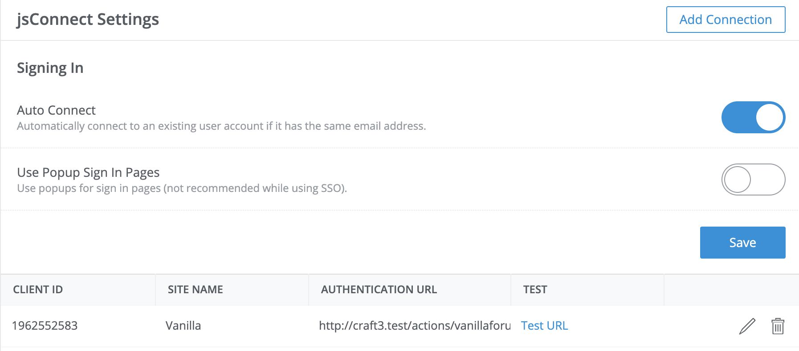
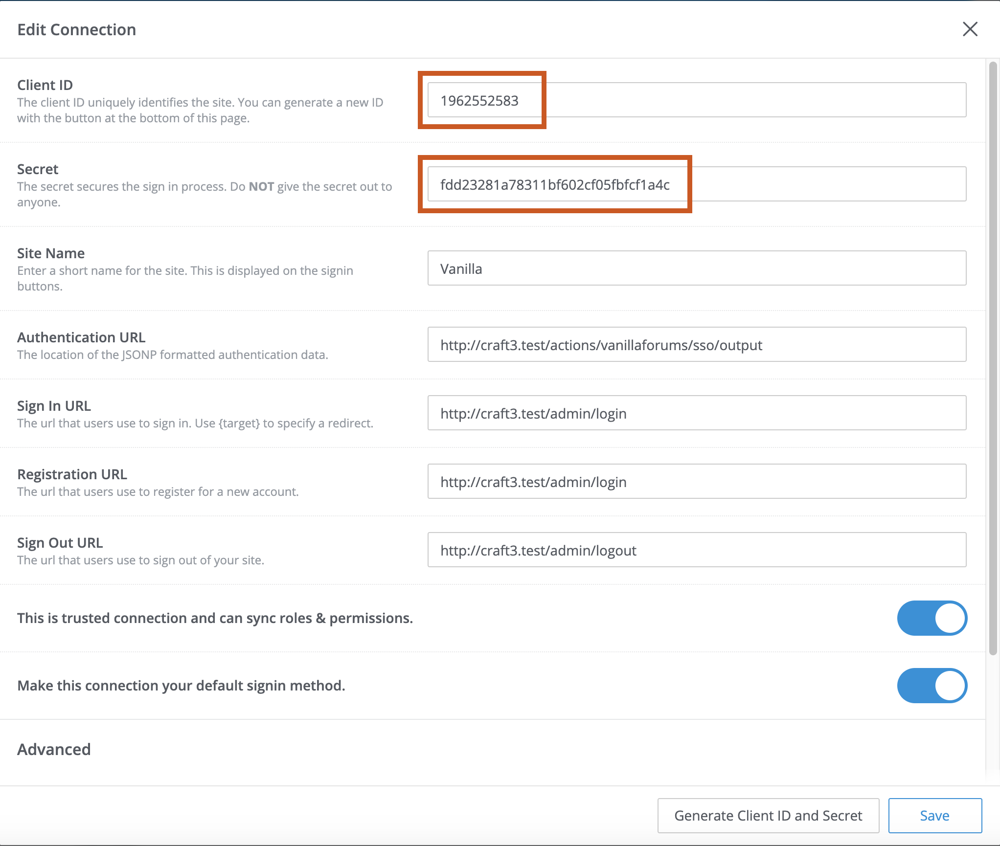

[](https://scrutinizer-ci.com/g/nystudio107/craft-vanillaforums/?branch=v1) [](https://scrutinizer-ci.com/g/nystudio107/craft-vanillaforums/?branch=v1) [](https://scrutinizer-ci.com/g/nystudio107/craft-vanillaforums/build-status/v1) [](https://scrutinizer-ci.com/code-intelligence)

# Vanilla Forums plugin for Craft CMS 3.x

Single Sign On plugin for Vanilla Forums/jsConnect and Craft CMS


Related: [Vanillaforums for Craft 2.x](https://github.com/nystudio107/vanillaforums)

## Requirements

This plugin requires Craft CMS 3.0.0 and Vanilla Forums 3 & jsConnect 1.6 or later.

## Installation

To install Vanilla Forums, follow these steps:

1. Install with Composer via `composer require nystudio107/craft-vanillaforums` from your project directory
2. Install the plugin via `./craft install/plugin vanillaforums` via the CLI -or- in the Craft Control Panel under Settings > Plugins

You can also install Vanilla Forums via the **Plugin Store** in the Craft CP.

Vanilla Forums works on Craft 3.x.

## Vanilla Forums Overview

The Vanilla Forums plugins allows you to have a Single Sign-On (SSO) integration with [Craft CMS](https://craftcms.com/) and [Vanilla Forums](https://success.vanillaforums.com/kb/articles/157-self-hosting-basics).

That means that Craft CMS's login is used to auth. Then users are automatically signed in to Vanilla Forums without having to login in separately.

## Configuring Vanilla Forums

1. Install jsConnect.  Make sure you have installed the [jsConnect plugin](https://open.vanillaforums.com/addon/jsconnect-plugin), and follow the documentation for [Vanilla SSO](https://success.vanillaforums.com/kb/articles/34-jsconnect) setup.

2. Go to your Vanilla Forums Dashboard &rarr; Settings, under Users click on **jsConnect**, and enabled **Auto Connect** and disable **Use Popup Sign In Pages** 

3. Then click on **Add Connection**.  Click on **Generate Client ID and Secret** to generate random Client ID and Secret fields 

3. For the **Authentication URL** put in `https://example.com/actions/vanillaforums/sso/output` (swap out `https://example.com` for your own site URL) which is a controller endpoint provided by Vanilla Forums that handles the SSO for you.

3. Next in the Craft CP, go to Settings &rarr; Plugins &rarr; Vanilla Forums and enter the same Client ID and Secret from step 3

## Using Vanilla Forums

### Site-Wide Single Sign On (SSO)

Assuming you've set up everything properly, all you have to do for [Site-Wide SSO](https://success.vanillaforums.com/kb/articles/34-jsconnect#technical-overview) is ensure that the **Authentication URL** is set to `https://example.com/actions/vanillaforums/sso/output` (swap out `https://example.com` for your own site URL) which is a controller endpoint provided by Vanilla Forums that handles the SSO for you.

This will generate a properly configured `jwt` response for the jsConnect SSO.

You can test that it's working by clicking on the **Test URL** link under Users &rarr; jsConnect, it should look something like this:

    test({"uniqueid":"1","name":"Admin","email":"admin@example.com","photourl":"http:\/\/example.com\/cpresources\/userphotos\/admin\/100\/profilepic.jpg?x=abF7BLdua","client_id":"12345678","signature":"b1670c794d13a5214b3d0ddd3d9a2293"})

This endpoint attempts to SSO the currently logged in user.

### Embedded Single Sign On (SSO)

Assuming you've set up everything properly, all you have to do for [Embedded SSO](https://docs.vanillaforums.com/help/sso/jsconnect/#method-2-embedded-sso) (for things like blog comments, etc.) is to go to your Vanilla Forums Dashboard, click on Forum &rarr; Blog Comments &rarr; Universial Code and follow the instructions there.

You'll need to add a line after the `var vanilla_identifier` that looks like this to enable SSO for embedded comments:
```twig
    var vanilla_sso = '{{ vanillaforums.sso.embeddedOutput }}'; // Your SSO string.
```

That will output an encoded string of characters that should look something like this:

    eyJ1bmlxdWVpZCI6IjEiLCJuYW1lIjoiQWRtaW4iLCJlbWFpbCI6ImFuZHJld0BtZWdhbG9tYW5pYWMuY29tIiwicGhvdG91cmwiOiJodHRwOlwvXC9UYXN0eVN0YWtlcy5jb21cL2NwcmVzb3VyY2VzXC91c2VycGhvdG9zXC9hbmRyZXdAbWVnYWxvbWFuaWFjLmNvbVwvMTAwXC9mcmFua19sZy5qcGc/eD1LTVFrMWl0aDciLCJjbGllbnRfaWQiOiIxODY0MjUyMjMwIn0= da4d6c328a730a9c7096bdbd53d2a408f5a5958c 1438711686 hmacsha1

### Tips & Hints

Read over the [jsConnect Documentation](https://docs.vanillaforums.com/help/sso/jsconnect/) carefully so that you understand how the SSO works.

Specifically pay attention to the [Tightening the Integration](https://docs.vanillaforums.com/help/sso/jsconnect/#tightening-the-integration) section. You'll want the **Forums** link on your host site to go to `https://example.com/forums/sso` to have it auto-connect the SSO without the user having to click a button to make it happen.

If you're using Nginx with "pretty URLs" in the `config.php`:
```php
$Configuration['Garden']['RewriteUrls'] = true;
```

Then you'll want a rewrite rule that looks something like this in your Nginx config:

```
    # Handle requests for the Vanilla Forums in the /forums sub-folder
    location /forums {
        try_files $uri @vanilla;
    }

    location @vanilla {
        rewrite ^/forums(/.*) /forums/index.php?p=$1&$args last;
    }
```

Check out the [Apache](https://docs.vanillaforums.com/developer/backend/server-apache/) and [Nginx](https://docs.vanillaforums.com/developer/backend/server-nginx/) guides for details.

## SSO Data Events

Vanilla Forums throws a `SsoDataEvent` event, in case you want to modify the SSO Data that will be passed along to Vanilla Forums.

`SsoDataEvent` is the event that is triggered before the SSO data is used, you may modify the [[SsoDataEvent::data]] as you see fit. You may set [[SsoDataEvent::isValid]] to `false` to prevent SSO data from being used.

```php
use nystudio107\vanillaforums\services\Sso;
use nystudio107\vanillaforums\events\SsoDataEvent;

Event::on(Sso::class,
    Sso::EVENT_SSO_DATA,
    function(SsoDataEvent $event) {
        // potentially set $event->isValid or modify $event->ssoData
    }
);
```

For instance, you might modify [[SsoData::roles]] to add custom permissions roles.

## Vanilla Forums Roadmap

Some things to do, and ideas for potential features:

* Release it

Brought to you by [nystudio107](https://nystudio107.com/)
